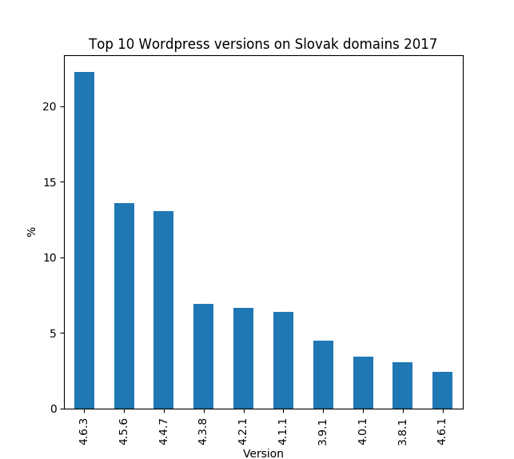
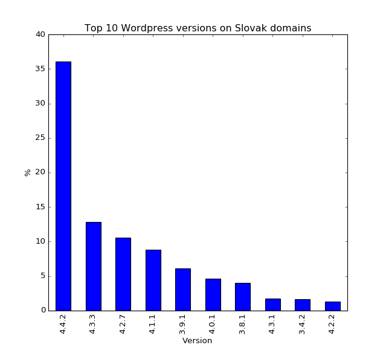

#Wordpress versions used on Slovak domains

## 2017

Total domains scanned **316 625**. WordPress detected on **22 314 (7%)** domains.
WordPress domains updated to latest version **4971 (22%)**.



## 2016

Total domains scanned **301 433**. WordPress detected on **24 355 (8%)** domains. WordPress domains updated to latest version **8788 (36%)**.



### Jupyter Notebook

[View data processing and visualization notebook online](https://github.com/richard-mihalovic/wordpress-versions-on-slovak-domains/blob/master/notebook/WordpressVersionsNotebook.ipynb).

### Requirements
Python 3.x installed  
Scrapy (for collecting data)  
Jupyter Notebook (for data processing and visualization)

### Collect data
```
pip3 install scrapy
./grab_data.sh
```

### Visualize data
```
pip3 install jupyter matplotlib pandas
jupyter-notebook notebook/WordpressVersionsNotebook.ipynb
```
